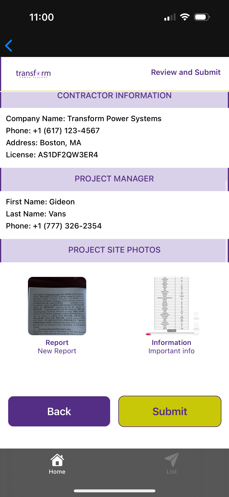
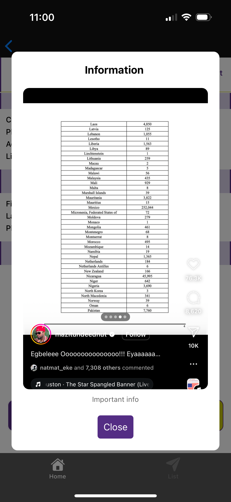
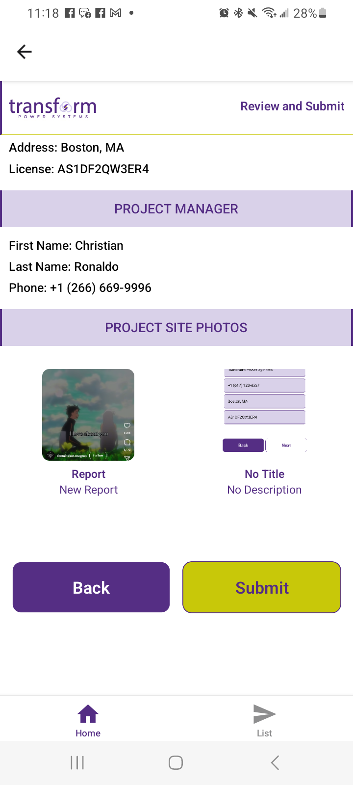

# TPS Site Report App
This is Transform Power System's Site Reporting Mobile for both iOS and Android

**Transform Power Systems** [TPS](https://tps-energy.com/) 

# Mobile Screenshots 👋
## iOS
 
 
 
 
 
 
 
 

## Android
 
 
 
 
 
 
 
 
